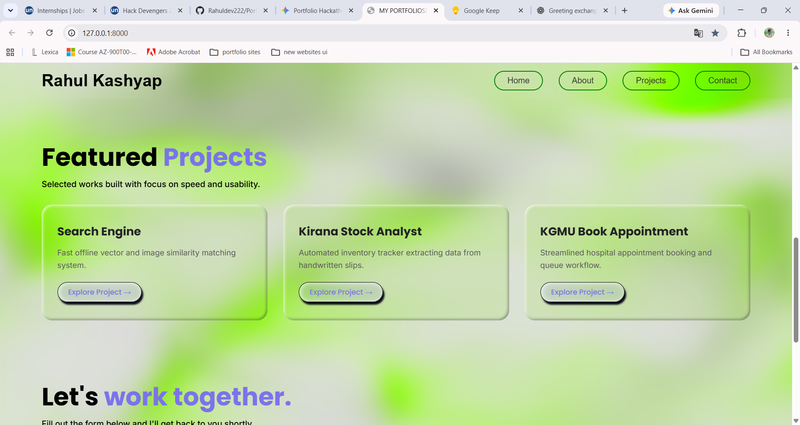
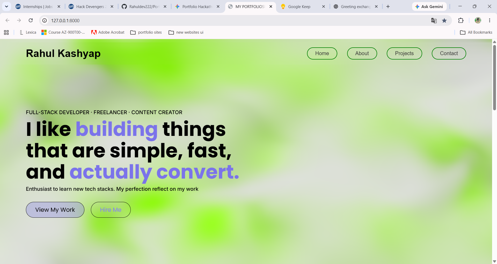
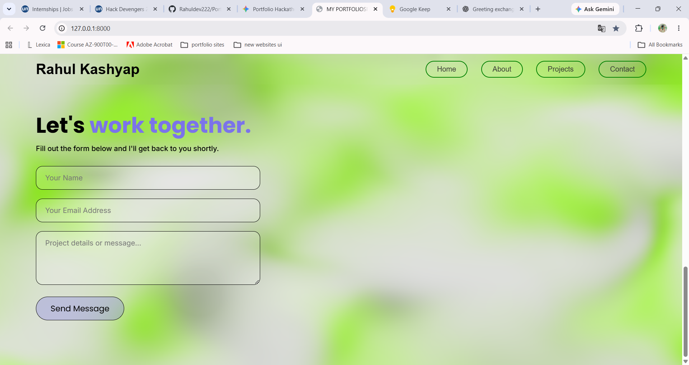

#  Rahul Kashyap — Developer Portfolio

A modern, interactive, and responsive developer portfolio built with **Django, HTML, CSS, and JavaScript**, featuring immersive 3D ambient visuals and a modular template-based architecture.

The portfolio is designed to present projects, technical skills, developer information, and contact details through a clean and performance-focused interface.

---

## Key Features

- **Hardware-Accelerated 3D Visuals:**  
  Immersive and responsive ambient 3D background visuals powered by **Vanta.js and Three.js**, creating an interactive experience while keeping the interface lightweight.

- **Modular Full-Stack Architecture:**  
  Built with **Django** using a structured separation between backend logic, URL routing, reusable templates, and static assets.

- **Interactive Proof-of-Work:**  
  Dedicated project sections designed to showcase development work, technologies used, project details, deployment links, and source-code repositories.

- **Performance & Responsive Design:**  
  Custom CSS with a lightweight frontend approach, smooth scrolling, responsive layouts, optimized visual effects, and minimal unnecessary dependencies.

- **Reusable Portfolio Boilerplate:**  
  The project structure is organized so that sections such as About, Projects, and Contact can be easily customized and reused.

- **Smooth Section Navigation:**  
  JavaScript-powered smooth scrolling provides quick navigation between Home, About, Projects, and Contact sections.

- **Django Contact Form Ready:**  
  Contact section is structured as a Django-compatible POST form with CSRF protection.

---

## Tech Stack

### Backend

- Python
- Django

### Frontend

- HTML5
- CSS3
- JavaScript

### Visuals

- Three.js
- Vanta.js
- Vanta Fog

### Fonts

- Poppins
- Inter

### Tools

- Git
- GitHub
- Visual Studio Code

---

## 🏗️ Architecture

The portfolio follows a modular Django architecture.

```text
Browser
   │
   ▼
Django URL Routing
   │
   ▼
Django Views
   │
   ▼
Templates
   │
   ├── Hero / Home
   ├── About
   ├── Projects
   └── Contact
   │
   ▼
CSS + JavaScript
   │
   ▼
Interactive UI

```

## 📸 Screenshots


